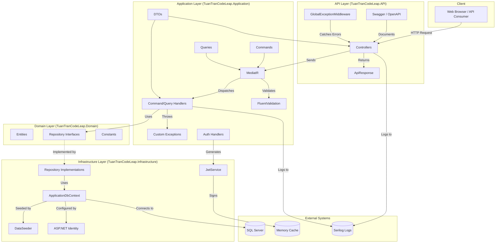
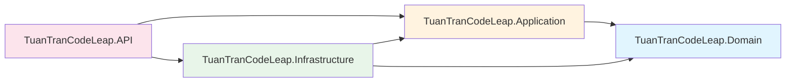
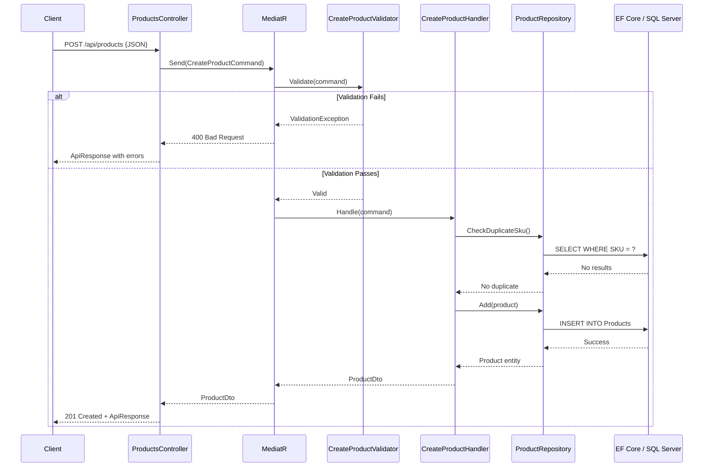
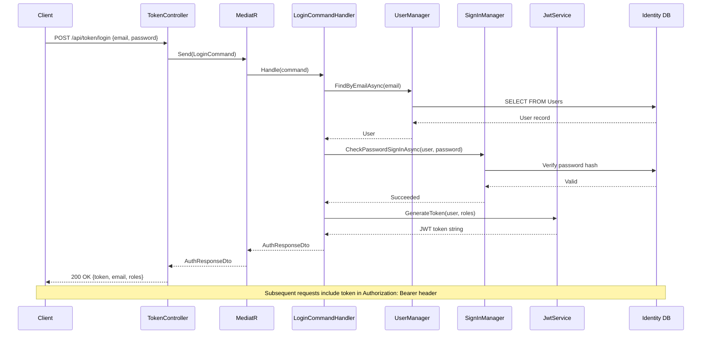
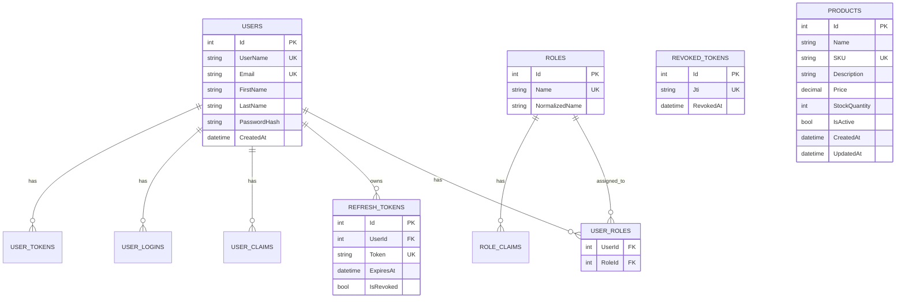
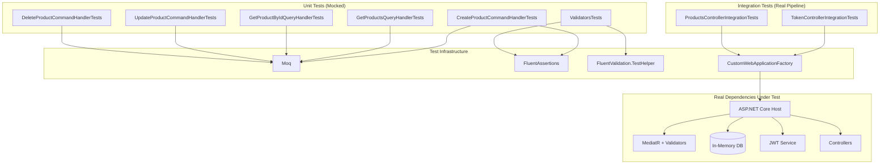
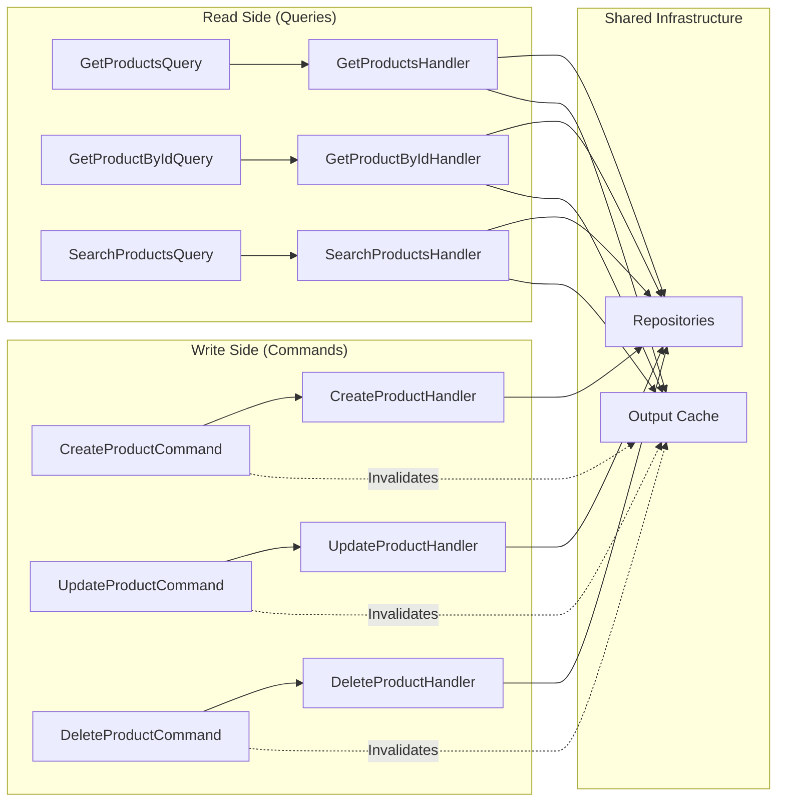

# TuanTranCodeLeap Architecture

## System Overview

---

## Layer Responsibilities

| Layer | Project | Responsibility |
|-------|---------|---------------|
| **API** | `TuanTranCodeLeap.API` | HTTP endpoints, middleware, DI registration, Swagger docs |
| **Application** | `TuanTranCodeLeap.Application` | Business logic via CQRS handlers, validation, DTOs, auth commands |
| **Domain** | `TuanTranCodeLeap.Domain` | Entities, repository contracts, business rules/constants |
| **Infrastructure** | `TuanTranCodeLeap.Infrastructure` | Data access, EF Core, Identity, JWT implementation, seeding |

---

## Dependency Direction

**Rule**: Dependencies point inward. Domain has zero external dependencies.

---

## Request Flow (Create Product Example)

---

## Authentication Flow

---

## Database Schema

---

## Test Architecture

---

## CQRS Pattern Detail

---

## File Locations

| Diagram | File |
|---------|------|
| System Overview | `ARCHITECTURE.md` (this file) |
| High-Level Architecture | `README.md` > `## Architecture` |
| Test Architecture | `README.md` > `### Integration Test Architecture` |
