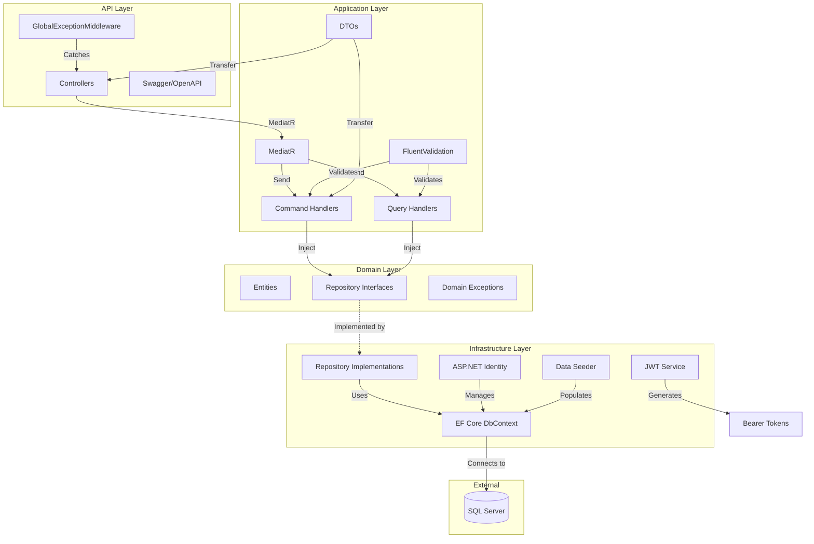
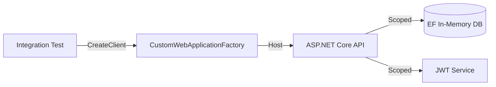

# TuanTranCodeLeap API

A .NET 9 Web API built with **Clean Architecture**, **CQRS** pattern, **ASP.NET Identity** with custom tables, **JWT authentication**, and comprehensive **automated testing**.

## Architecture



## Design Decisions

| Decision | Rationale |
|----------|-----------|
| **CQRS with MediatR** | Separates read/write operations, improves scalability and allows independent optimization of queries and commands |
| **Repository Pattern** | Abstracts data access; allows swapping SQL Server for other providers without changing business logic |
| **Custom Identity Tables** | Uses `Users`, `Roles`, `UserRoles` instead of default `AspNetUsers` for cleaner database naming |
| **FluentValidation over Data Annotations** | More expressive validation rules, centralized in Application layer, testable independently |
| **JWT + Refresh Tokens** | Stateless authentication with token revocation capability via `RevokedToken` table |
| **Serilog + File Rolling** | Structured logging for production debugging with daily log rotation |
| **In-Memory DB for Integration Tests** | Fast test execution without SQL Server dependency; isolated per test via GUID-named databases |
| **xUnit + Moq + FluentAssertions** | Industry-standard .NET testing stack with expressive assertion syntax |

## Tech Stack

- **.NET 9.0**
- **Entity Framework Core 9.0** (SQL Server)
- **ASP.NET Core Identity** (custom tables)
- **MediatR** (CQRS pattern)
- **FluentValidation**
- **JWT Bearer Authentication**
- **Serilog** (structured logging)
- **Swashbuckle** (Swagger/OpenAPI)

---

## Build & Run

### Prerequisites
- .NET 9.0 SDK
- SQL Server instance

### 1. Restore Packages
```bash
dotnet restore
```

### 2. Configure Connection String
Edit `TuanTranCodeLeap.API/appsettings.json`:
```json
"ConnectionStrings": {
  "DefaultConnection": "Server=YOUR_SERVER;Database=CodeLeapDB;User Id=sa;Password=YOUR_PASSWORD;Trusted_Connection=False;MultipleActiveResultSets=true;TrustServerCertificate=True;"
}
```

### 3. Create & Apply Migrations
```bash
cd TuanTranCodeLeap.API
dotnet ef migrations add InitialCreate --project ../TuanTranCodeLeap.Infrastructure --startup-project .
dotnet ef database update --project ../TuanTranCodeLeap.Infrastructure --startup-project .
```

### 4. Build
```bash
dotnet build
```

### 5. Run
```bash
cd TuanTranCodeLeap.API
dotnet run
```

Open Swagger UI: `http://localhost:5000/swagger` (check console output for actual port)

---

## API Endpoints

### Authentication (`/api/token`)

| Method | Endpoint | Auth | Description |
|--------|----------|------|-------------|
| `POST` | `/api/token/register` | No | Create new user account |
| `POST` | `/api/token/login` | No | Authenticate and receive JWT token |

### Products (`/api/products`)

| Method | Endpoint | Auth | Description |
|--------|----------|------|-------------|
| `GET` | `/api/products` | JWT | Get paginated products |
| `GET` | `/api/products/{id}` | JWT | Get product by ID |
| `GET` | `/api/products/search` | JWT | Search/filter products |
| `POST` | `/api/products` | JWT | Create new product |
| `PUT` | `/api/products/{id}` | JWT | Update product |
| `DELETE` | `/api/products/{id}` | JWT | Delete product |

**Example: Register**
```bash
curl -X POST http://localhost:5000/api/token/register \
  -H "Content-Type: application/json" \
  -d '{"email":"user@example.com","password":"Password123!","firstName":"John","lastName":"Doe"}'
```

**Example: Login**
```bash
curl -X POST http://localhost:5000/api/token/login \
  -H "Content-Type: application/json" \
  -d '{"email":"user@example.com","password":"Password123!"}'
```

**Example: Get Products**
```bash
curl -X GET "http://localhost:5000/api/products?pageNumber=1&pageSize=10" \
  -H "Authorization: Bearer YOUR_JWT_TOKEN"
```

---

## Testing

### Run All Tests
```bash
dotnet test TuanTranCodeLeap.Tests/TuanTranCodeLeap.Tests.csproj
```

### Run Only Unit Tests
```bash
dotnet test TuanTranCodeLeap.Tests/TuanTranCodeLeap.Tests.csproj --filter "FullyQualifiedName~UnitTests"
```

### Run Only Integration Tests
```bash
dotnet test TuanTranCodeLeap.Tests/TuanTranCodeLeap.Tests.csproj --filter "FullyQualifiedName~IntegrationTests"
```

### Test Coverage

| Category | Test Class | Scenarios |
|----------|-----------|-----------|
| **Unit** | `CreateProductCommandHandlerTests` | Duplicate SKU, happy path |
| **Unit** | `GetProductsQueryHandlerTests` | Pagination, page boundaries |
| **Unit** | `GetProductByIdQueryHandlerTests` | Found, not found |
| **Unit** | `UpdateProductCommandHandlerTests` | Not found, duplicate SKU |
| **Unit** | `DeleteProductCommandHandlerTests` | Not found, successful delete |
| **Unit** | `ValidatorsTests` | 6 validators, valid/invalid inputs |
| **Integration** | `TokenControllerIntegrationTests` | Register, login, invalid credentials |
| **Integration** | `ProductsControllerIntegrationTests` | Auth flow, pagination, not found, unauthorized |

**Total: 46 tests** (0 failures on latest run)

### Integration Test Architecture



- `CustomWebApplicationFactory` replaces SQL Server with EF Core In-Memory database
- Each test class gets a unique database name (`Guid.NewGuid()`) to prevent cross-test pollution
- Tests exercise real HTTP endpoints with actual JWT token generation/validation

---

## Project Structure

```
TuanTranCodeLeap/
├── TuanTranCodeLeap.Domain/              # Entities, repository interfaces, constants
│   ├── Entities/                         # User, Role, Product
│   └── Repositories/                     # IProductRepository, IUserRepository, etc.
│
├── TuanTranCodeLeap.Application/          # Business logic, CQRS, validation
│   ├── Auth/                             # RegisterCommand, LoginCommand
│   ├── Common/                           # Behaviors, Exceptions
│   ├── DTOs/                             # Request/Response DTOs
│   ├── Handlers/                         # Command & Query handlers
│   └── Queries/                          # CQRS query/command definitions
│
├── TuanTranCodeLeap.Infrastructure/       # Data access, external services
│   ├── Auth/                             # JwtService
│   ├── Data/                             # ApplicationDbContext, DataSeeder
│   ├── Migrations/                       # EF Core migrations
│   └── Repositories/                     # Repository implementations
│
├── TuanTranCodeLeap.API/                  # Web API, middleware, configuration
│   ├── Common/                           # ApiResponse, AuthorizeCheckOperationFilter
│   ├── Controllers/                      # TokenController, ProductsController
│   ├── Middleware/                       # GlobalExceptionMiddleware
│   └── Program.cs                        # DI registration, pipeline setup
│
└── TuanTranCodeLeap.Tests/                # Automated tests
    ├── UnitTests/                        # Handler & validator tests (xUnit + Moq)
    └── IntegrationTests/                 # Endpoint tests (WebApplicationFactory)
```

---

## Configuration

### JWT Settings (`appsettings.json`)
```json
"JwtSettings": {
  "SecretKey": "YourSuperSecretKeyThatIsAtLeast32CharactersLong!",
  "Issuer": "TuanTranCodeLeap",
  "Audience": "TuanTranCodeLeapUsers",
  "ExpirationInMinutes": 60
}
```

### Password Requirements
- Minimum 6 characters
- At least one uppercase, one lowercase, one digit, one non-alphanumeric

### Logging
- Console output (development)
- Daily rolling files: `logs/log-{date}.txt`

---

## License

This project is created for demonstration purposes.
